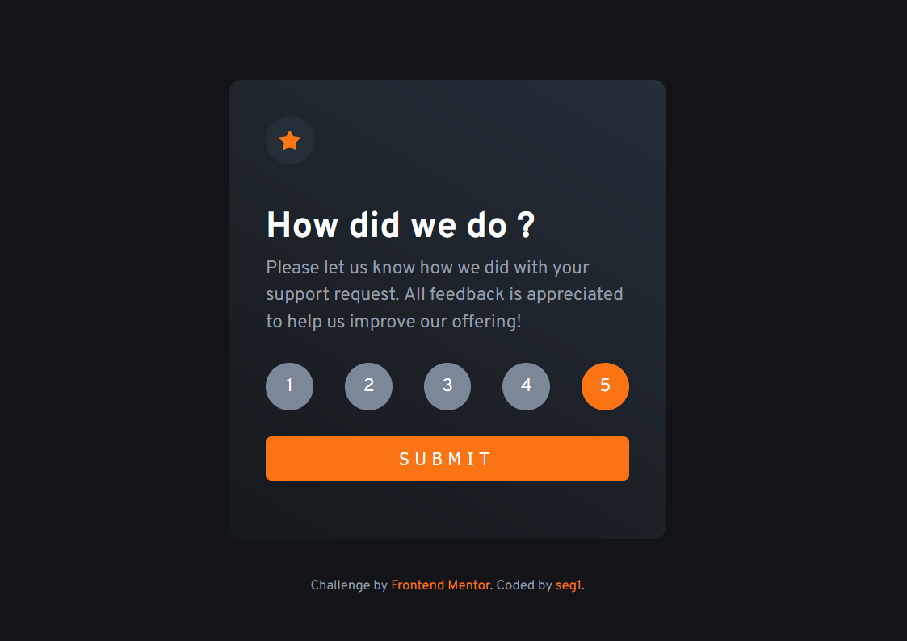

# Frontend Mentor - Interactive rating component solution

This is a solution to the [Interactive rating component challenge on Frontend Mentor](https://www.frontendmentor.io/challenges/interactive-rating-component-koxpeBUmI). Frontend Mentor challenges help you improve your coding skills by building realistic projects. 

## Table of contents

- [Overview](#overview)
  - [The challenge](#the-challenge)
  - [Screenshot](#screenshot)
  - [Links](#links)
- [My process](#my-process)
  - [Built with](#built-with)
- [Author](#author)
- [Acknowledgments](#acknowledgments)

## Overview

### The challenge

Users should be able to:

- View the optimal layout for the app depending on their device's screen size
- See hover states for all interactive elements on the page
- Select and submit a number rating
- See the "Thank you" card state after submitting a rating

### Screenshot

### Links

- Solution URL: [Github](https://github.com/seg1-exe/rating-component)
- Live Site URL: [Github Pages](https://seg1-exe.github.io/rating-component/)

## My process

### Built with

- Semantic HTML5 markup
- CSS custom properties
- Flexbox
- Vanilla javascript

## Author

- My bento - [seg1](https://bento.me/seg1)
- Frontend Mentor - [@seg1](https://www.frontendmentor.io/profile/rutabagarre)
- Twitter - [@seg1-exe](https://www.twitter.com/seg1-exe)

## Acknowledgments

Thanks to Alexy who took on the challenge at the same time as me !
